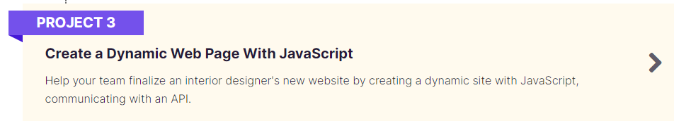

  
  
  

  
  ## Project n°3 from Openclassrooms's Web Development training program

 

## Instructions

Back-end setup : 
 - Go to Backend folder
 - `npm install`
 - `npm start`

If you wish to open both back-end and front end, do it separatly in 2 VSCode instances to avoid any problem (Fox example : LiveServer would refresh the page anytime back-end get modified)
